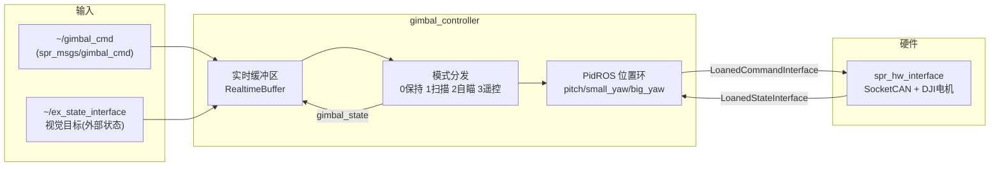

# spr_ws —— 哨兵机器人 ROS2 控制工作区

基于 **ROS2 + ros2_control** 的 RoboMaster 哨兵（Sentry）机器人上位机软件工作区，包含：

- **硬件接口**：通过 CAN 总线驱动 DJI 电机（`spr_hw_interface`）
- **云台控制器**：pitch / small_yaw / big_yaw 三轴位置环控制器，支持扫描 / 自瞄 / 遥控 / 保持四种模式（`gimbal_controller`）
- **机器人描述**：哨兵 URDF/Xacro 模型（`spr_sentry_description`）
- **启动与配置**：controller_manager 配置与 ros2_control 硬件描述（`spr_ctrl_bring_up`）

---

## 1. 系统架构



- 上位机（控制器）只负责**平滑轨迹 + 扫↔跟切换 + 限位**；
- **目标预测（卡尔曼）、视觉延迟补偿由电控/视觉侧负责**；
- 控制器内部所有订阅/发布均通过 `realtime_tools` 双缓冲与实时发布器，保证 1000Hz 控制循环不被阻塞。

---

## 2. 目录结构

```
spr_ws/
├── common/
│   └── ros2_control/        # 第三方参考源码（COLCON_IGNORE，不参与构建）
└── src/
    ├── spr_hw_interface/            # 硬件接口（system 类型，CAN + DJI 电机）
    ├── spr_sentry_description/      # 哨兵 URDF/Xacro 模型
    ├── spr_sentry_controllers/
    │   └── gimbal_controller/       # 云台控制器
    └── spr_ctrl_bring_up/           # 启动与配置
        ├── config/sentry.yaml       # controller_manager 配置
        └── description/sentry.xacro # ros2_control 硬件描述
```

---

## 3. 硬件平台

| 部件 | 说明 |
|---|---|
| 总线 | SocketCAN（`can0` / `can1` 两路） |
| 云台电机 | `can0`：bigyaw(DM6006)、small_yaw(GM6020)、pitch(DM4310) |
| 底盘电机 | `can1`：4 × M3508（麦克纳姆轮） |
| 支持型号 | DM6006 / DM4310 / GM6020 / M3508 / M2006 / VIRTUAL_JOINT |

关节接口定义见 `spr_ctrl_bring_up/description/sentry.xacro` 的 `<ros2_control>` 段。

---

## 4. 软件模块

### 4.1 spr_hw_interface —— 硬件接口

- `SystemInterface` 实现，负责 CAN 报文收发、电机反馈解码、看门狗超时检测。
- SocketCAN 封装源自 tide_hw_interface 项目。
- 导出接口：`<joint>/position`、`<joint>/velocity` 等（按 Xacro 配置）。

### 4.2 spr_sentry_description —— 机器人描述

- 哨兵 URDF：base / bigyaw / small_yaw / pitch 云台 + 四轮底盘。
- `spr_ctrl_bring_up/description/sentry.xacro` 中通过 `<ros2_control>` 声明硬件插件与关节接口。

### 4.3 spr_sentry_controllers / gimbal_controller —— 云台控制器

- 控制器类型：`spr_gimbal_controller/SprGimbalController`
- 控制轴：`pitch_joint`、`small_yaw_joint`、`big_yaw_joint`（位置环，`control_toolbox::PidROS`）
- 接口：`command_interface_configuration()` / `state_interface_configuration()` 均请求 `<joint>/position`

**话题：**

| 话题 | 方向 | 类型 | 说明 |
|---|---|---|---|
| `~/gimbal_cmd` | 订阅 | `spr_msgs/gimbal_cmd` | 外部命令（模式 + 角度参考） |
| `~/ex_state_interface` | 订阅 | `spr_msgs/gimbal_state` | 外部状态（视觉目标角度） |
| `~/gimbal_state` | 发布 | `spr_msgs/gimbal_state` | 云台状态反馈 |

**模式（`mode` 字段）：**

| 值 | 模式 | 行为 |
|---|---|---|
| 0 | 保持 | 保持当前/给定角度 |
| 1 | 扫描 | 时间驱动三角波扫描 + 斜坡限速 + 限位，发现视觉目标自动切自瞄 |
| 2 | 自瞄 | 跟踪外部状态（视觉）目标角度 |
| 3 | 遥控 | 直接采用命令下发的角度参考 |

**参数（`gimbal_controller_parameter.yaml`，generate_parameter_library 生成）：**
每个轴（`pitch` / `small_yaw` / `big_yaw`）下：
- `joint`：关节名（必须与 URDF `<joint name>` 一致）
- `max` / `min`：角度软限位
- `scan_add` / `scan_range`：扫描步进（每周期最大角增量）与扫描范围
- `pid`：`p` / `i` / `d` / `i_clamp_max` / `i_clamp_min` / `antiwindup`

### 4.4 spr_ctrl_bring_up —— 启动与配置

- `config/sentry.yaml`：controller_manager 参数（`update_rate: 1000Hz`、`joint_state_broadcaster` 等）。
- 目前 `launch/` 目录为空，启动文件待补充。

---

## 5. 构建

```bash
cd spr_ws
colcon build --symlink-install
source install/setup.bash
# 仅构建某个包：
colcon build --packages-select gimbal_controller
```

---

## 6. 运行

```bash
# 1) 启动硬件接口 + controller_manager（配置见 config/sentry.yaml）
#    （launch 文件待补充，或按 ros2_control 标准流程加载）

# 2) 加载并激活云台控制器
ros2 control load_controller spr_gimbal_controller
ros2 control set_controller_state spr_gimbal_controller active

# 3) 下发模式与目标
ros2 topic pub /spr_gimbal_controller/gimbal_cmd spr_msgs/msg/GimbalCmd "{mode: 2, ...}"
```

> 注意：`spr_msgs`（含 `GimbalCmd` / `GimbalState`）为项目自定义消息包，需先构建。

---

## 7. 依赖

- ROS2（ros2_control / controller_manager）
- `controller_interface`、`hardware_interface`
- `control_toolbox`（PidROS）
- `realtime_tools`（双缓冲 / 实时发布器）
- `generate_parameter_library`（参数代码生成）
- `pluginlib`
- `spr_msgs`（自定义消息包）

---

## 8. 说明与待办

- [ ] `spr_ctrl_bring_up/launch/` 启动文件
- [ ] `spr_msgs` 消息定义补全（视觉目标角速度字段，用于速度前馈）
- [ ] 云台控制器 `update()` 接线完善（模式结果 → 命令接口 `set_value`）
- [ ] IMU 加入后补充底盘角速度前馈（空间稳定）
