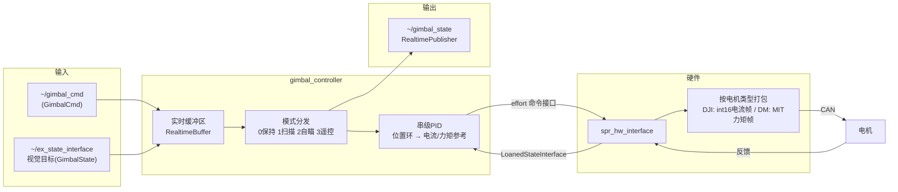

# sentry_code —— 哨兵机器人 ROS2 控制工作区

基于 **ROS2 + ros2_control** 的 RoboMaster 哨兵（Sentry）机器人上位机软件工作区，包含：

- **硬件接口**：三种后端一键切换 —— 真机 CAN（DJI/DM 电机，effort 电流/力矩控制）、`EffortMockSystem` 模拟、MuJoCo 物理仿真（`spr_hw_interface`）
- **云台控制器**：pitch / small_yaw / big_yaw 三轴串级控制（位置环 → 电流/力矩参考），支持扫描 / 自瞄 / 遥控 / 保持四种模式（`gimbal_controller`）
- **机器人描述**：哨兵 URDF/Xacro 模型（`spr_sentry_description`）
- **自定义消息**：GimbalCmd / GimbalState（`spr_msgs`）
- **启动与配置**：controller_manager 配置与 ros2_control 硬件描述（`spr_ctrl_bring_up`）

---

## 1. 系统架构



- 上位机（控制器）负责**平滑轨迹 + 扫↔跟切换 + 位置环**，输出**电流/力矩参考（原始值）**；
- 控制器内部所有订阅/发布均通过 `realtime_tools` 双缓冲与实时发布器，保证 1000Hz 控制循环不被阻塞。

---

## 2. 目录结构

```
sentry_code/
├── stop_sentry.sh              # 清理残留 ROS 进程
├── run_sentry.sh               # 一键启动（清理 + 启动，mock/real/mujoco 三模式）
├── setting.sh                  # 打开 CAN 口（can0/can1）
├── discussion/                 # 设计讨论文档（COLCON_IGNORE，不参与构建）
└── src/
    ├── spr_msgs/                      # 自定义消息（GimbalCmd / GimbalState）
    ├── spr_hw_interface/              # 硬件接口：真机 CAN + EffortMockSystem + MujocoInterface
    │   ├── include/mujoco_sim_interface.hpp
    │   └── src/mujoco_sim_interface.cpp
    ├── spr_sentry_description/        # 哨兵 URDF/Xacro 模型 + MuJoCo 模型
    │   └── models/sentry.xml          # MuJoCo 仿真模型（URDF 转换 + 手工补全）
    ├── spr_sentry_controllers/
    │   └── gimbal_controller/         # 云台控制器
    └── spr_ctrl_bring_up/             # 启动与配置
        ├── config/sentry.yaml         # controller_manager 配置
        ├── description/sentry.xacro   # ros2_control 硬件描述（hardware_type 参数）
        └── launch/sentry_bringup.launch.py  # 启动文件（hardware_type 参数）
```

---

## 3. 硬件平台

| 部件 | 说明 |
|---|---|
| 总线 | SocketCAN（`can0` / `can1` 两路） |
| 云台电机 | `can0`：big_yaw(DM6006, MIT 力矩)、small_yaw(GM6020, 电流)、pitch(DM4310, MIT 力矩) |
| 底盘电机 | `can1`：4 × M3508（电流，麦克纳姆轮） |
| 控制方式 | DJI 电机：电流模式（int16 电流帧，0x200 组）；达妙电机：MIT 力矩模式（float 力矩，12 位线性映射） |
| 支持型号 | DM6006 / DM4310 / GM6020 / M3508 / M2006 / VIRTUAL_JOINT |

> 达妙 MIT 映射满量程（`pos_max/vel_max/tor_max`）须与达妙调试助手设定**完全一致**，否则控制命令会等比例缩放；当前默认 ±12.5 rad / ±30 rad/s / ±10 N·m。
> 关节接口定义见 `spr_ctrl_bring_up/description/sentry.xacro` 的 `<ros2_control>` 段。

---

## 4. 软件模块

### 4.1 spr_hw_interface —— 硬件接口

- `SystemInterface` 实现，负责 CAN 报文收发、电机反馈解码、看门狗超时检测。
- SocketCAN 封装源自 tide_hw_interface 项目。
- 命令接口：`<joint>/effort`（云台，电流/力矩原始值）；状态接口：`<joint>/position`、`<joint>/velocity`、`<joint>/effort`。
- `write()` 按电机类型打包：
  - **DJI**（M3508 / GM6020 / M2006）：effort → int16 电流 → 0x200 组帧（一帧带 4 电机）
  - **达妙**（DM6006 / DM4310）：effort → MIT 力矩帧（`encode_mit_frame`，p/v/kp/kd/t 位打包，帧 ID = CAN ID）
- `read()` 解码反馈：DJI 用编码器格式；达妙用 MIT 回传帧（`decode_dm_feedback`，位置/速度/力矩线性还原）。
- `on_activate()` 发送达妙使能帧。

**三种硬件后端**（通过 `hardware_type` 参数切换，控制器层完全无感）：

| 插件 | `hardware_type` | 说明 |
|---|---|---|
| `spr_hw_interface/SprHardwareInterface` | `real` | 真机 CAN（DJI + 达妙电机） |
| `spr_hw_interface/EffortMockSystem` | `mock` | 轻量 effort 模拟硬件，无真机调试控制链路（默认） |
| `mujoco_ros2_control/MujocoSystemInterface` | `mujoco` | MuJoCo 物理仿真（成熟方案，自带原生窗口） |

- **`EffortMockSystem`**：`read()` 按"实际被写入的命令接口"自动选择驱动（position → 低通跟随 / velocity → 速度跟随 / effort → 力矩驱动），命令接口未写入时保持 NaN。
- **`MujocoSystemInterface`**（`mujoco_ros2_control` 提供）：MuJoCo 仿真独立进程 + 共享内存桥接 ros2_control，`mujoco_model` 参数指向场景文件，支持 `scene:=` 切换。详见 §6.3。
- **`MujocoInterface`**（自研，保留备用）：早期无头实现（物理在接口内部），可用 `model_path` 指向 `models/sentry.xml`。

### 4.2 spr_sentry_description —— 机器人描述

- 哨兵 URDF：base / bigyaw / small_yaw / pitch 云台 + 四轮底盘。
- `spr_ctrl_bring_up/description/sentry.xacro` 中通过 `<ros2_control>` 声明硬件插件与关节接口。

### 4.3 spr_sentry_controllers / gimbal_controller —— 云台控制器

- 控制器类型：`spr_gimbal_controller/SprGimbalController`
- 控制轴：`pitch_joint`、`small_yaw_joint`、`bigyaw_joint`（串级 PID，位置环用 `control_toolbox::PidROS`）
- 命令接口：`<joint>/effort`（串级 PID 输出电流/力矩参考原始值，经 `output_min/max` 限幅）
- 状态接口：`<joint>/position`（读位置反馈，供位置环闭环）

**话题：**

| 话题 | 方向 | 类型 | 说明 |
|---|---|---|---|
| `~/gimbal_cmd` | 订阅 | `spr_msgs/msg/GimbalCmd` | 外部命令（mode + 目标角） |
| `~/ex_state_interface` | 订阅 | `spr_msgs/msg/GimbalState` | 外部状态（视觉目标角度） |
| `~/gimbal_state` | 发布 | `spr_msgs/msg/GimbalState` | 云台状态反馈（`RealtimePublisher` 实时安全发布） |

**模式（`mode` 字段）：**

| 值 | 模式 | 行为 |
|---|---|---|
| 0 | 保持 | 保持当前/给定角度 |
| 1 | 扫描 | 时间驱动三角波扫描 + 斜坡限速 + 限位，发现视觉目标自动切自瞄 |
| 2 | 自瞄 | 跟踪外部状态（视觉）目标角度 |
| 3 | 遥控 | 直接采用命令下发的角度参考 |

**参数（`gimbal_controller_parameter.yaml`，generate_parameter_library 生成）：**
每个轴（`pitch` / `small_yaw` / `big_yaw`）下：
- `joint`：关节名（必须与 URDF `<joint name>` 一致）
- `max` / `min`：角度软限位
- `scan_add` / `scan_range`：扫描步进（每周期最大角增量）与扫描范围
- `pid`：`p` / `i` / `d` / `i_clamp_max` / `i_clamp_min` / `output_min` / `output_max`（位置环输出限幅，即电流/力矩参考原始值的上下限）

### 4.4 spr_ctrl_bring_up —— 启动与配置

- `config/sentry.yaml`：controller_manager 参数（`update_rate: 500Hz`、`joint_state_broadcaster`、`gimbal_controller`、`chassis_controller` 等）。
- `description/sentry.xacro`：ros2_control 硬件描述。通过 `<xacro:arg name="hardware_type" default="mock"/>` + `xacro:if` 在 `real` / `mock` / `mujoco` 三个 `<hardware>` 块间切换，关节声明三套共用。
- `launch/sentry_bringup.launch.py`：启动文件（robot_state_publisher + controller_manager + spawner），新增 `hardware_type` launch 参数并传入 xacro。

---

## 5. 构建

```bash
cd sentry_code
colcon build --symlink-install
source install/setup.bash
# 仅构建某个包：
colcon build --packages-select spr_msgs spr_hw_interface gimbal_controller
# 生成 VS Code 编译数据库（聚合到根目录 compile_commands.json）：
colcon build --cmake-args -DCMAKE_EXPORT_COMPILE_COMMANDS=ON
python3 -c "import json,glob;out=[];[out.extend(json.load(open(f))) for f in glob.glob('build/*/compile_commands.json')];json.dump(out,open('compile_commands.json','w'),indent=2)"
```

---

## 6. 运行

### 6.1 一键启动（推荐）

```bash
cd sentry_code
./run_sentry.sh              # 默认 mock（模拟硬件）
./run_sentry.sh mock         # 模拟硬件
./run_sentry.sh real         # 真机（自动拉起 CAN 口 can0/can1）
./run_sentry.sh mujoco       # MuJoCo 物理仿真
```

`run_sentry.sh` 启动前会自动执行 `stop_sentry.sh`，清理上一次残留的进程
（`ros2_control_node` / `robot_state_publisher` 等），避免旧 controller_manager 占用
`/controller_manager` 服务导致 spawner 报 "Controller already loaded / no controller
with this name exists"。若只想清理不启动：`./stop_sentry.sh`。

### 6.2 手动启动

```bash
cd sentry_code
source install/setup.bash

# 1) 启动：robot_state_publisher + controller_manager + 控制器
#    hardware_type 可选 mock / real / mujoco，默认 mock
ros2 launch spr_ctrl_bring_up sentry_bringup.launch.py hardware_type:=mock

# 2) 下发遥控模式与目标角（BEST_EFFORT 下 --once 首帧可能丢失，用 -r 持续发布）
ros2 topic pub -r 5 /gimbal_controller/gimbal_cmd spr_msgs/msg/GimbalCmd \
  "{mode: 3, pitch_angle: 0.3, small_yaw_angle: 0.5, big_yaw_angle: 0.4}"

# 3) 查看状态回传
ros2 topic echo /gimbal_controller/gimbal_state

# 4) 查看关节反馈
ros2 topic echo /joint_states
```

> 注意：`spr_msgs`（含 `GimbalCmd` / `GimbalState`）为项目自定义消息包，需先构建。

---

### 6.3 MuJoCo 物理仿真（mujoco_ros2_control 成熟方案）

采用社区成熟方案 `mujoco_ros2_control`：MuJoCo 仿真独立进程（内嵌原生 simulate 窗口），
通过共享内存桥接 ros2_control，所有节点使用仿真时钟（`use_sim_time=true`）。

```bash
cd sentry_code
./run_sentry.sh mujoco            # 默认平地场景 flat
./run_sentry.sh mujoco rough      # 崎岖地形（hfield）
./run_sentry.sh mujoco ramp       # 坡道
./run_sentry.sh mujoco jump       # 飞坡
```

- **模型组织**（机器人/场景解耦，`spr_sentry_description/models/`）：
  - `sentry_robot.xml`：机器人本体（freejoint + 云台 + 4 轮 + 7 个 motor 力矩执行器）
  - `scenes/{flat,rough,ramp,jump}.xml`：场景 = `<include>` 机器人 + 世界（地面/地形/灯光）
- **场景切换**：`scene:=` 参数选场景文件，控制器/接口零改动；加新场景只需新增一个 xml。
- **MuJoCo 窗口**：启动后自动弹出（可拖动视角 / 暂停 / 单步，提供 reset_world 等服务）。
- **指令模式**：插件按 motor 执行器处理 effort 指令（position/velocity 需配 PID，见讨论文档）。
- **修改模型**：改 `models/` 下文件后 `colcon build --packages-select spr_sentry_description`。

> 注：mujoco 模式使用仿真时钟，若同时用 RViz 需开启 "Use Sim Time"。
> 架构/决策细节见 `discussion/mujoco_disscus/mujoco可视化窗口选择.md`。

### 6.4 RVIZ 可视化调试（模拟硬件 / 假电机模式）

无需真机 / 无 CAN 环境时，`sentry.xacro` 默认启用 `EffortMockSystem`（轻量 effort 模拟硬件），
可在 RVIZ 中直接观察云台三轴与底盘四轮的运动，用于调试串级 PID → effort 链路与里程计。

**启动步骤：**

```bash
cd sentry_code
source install/setup.bash

# 1) 启动 robot_state_publisher + controller_manager + 控制器（mock 模式）
./run_sentry.sh mock

# 2) 另开一个终端，单独启动 RViz（避免与控制器竞争资源）并加载项目自带视图
source install/setup.bash
rviz2 -d $(ros2 pkg prefix spr_ctrl_bring_up)/share/spr_ctrl_bring_up/config/rviz/sentry.rviz
```

**可视化内容（`config/rviz/sentry.rviz` 已预置）：**

- **Grid**：地面参考网格，参考系跟随 Fixed Frame；
- **TF**：显示 `odom → base_footprint → base_link → bigyaw_link → small_yaw_link → pitch_link` 与四个车轮的坐标系；
- **RobotModel**：订阅 `/robot_description`，渲染 URDF 模型（云台 + 麦克纳姆轮底盘）。

**调试要点：**

- **Fixed Frame**：无底盘运动时建议设为 `base_footprint`（云台 / 车轮坐标系稳定，便于观察关节转动）；
  下发底盘命令后建议设为 `odom`，可看到整个车体随里程计真实移动（`odom → base_footprint` TF 由 `chassis_controller` 动态发布）。
- **观察云台**：沿用第 6 节的话题发布遥控模式目标角，RVIZ 中 `pitch_link` / `small_yaw_link` / `bigyaw_link` 随之转动，
  对照 `ros2 topic echo /gimbal_controller/gimbal_state` 验证位置环闭环。
- **观察底盘**：若 `chassis_controller` 支持底盘速度指令，发布后四轮转动且车体在 `odom` 系下移动（模拟硬件下无真实里程，由控制器积分得到）。
- **无 TF / 模型不动的排查**：确认 `ros2 topic echo /joint_states` 有数据（joint_state_broadcaster 已加载）、
  `ros2 topic echo /tf` 有 `odom → base_footprint`（底盘控制器已激活）；若 RViz 报 "No transform"，
  检查 Fixed Frame 是否为有效帧（`base_footprint` / `odom`）。

> 提示：`use_sim_time` 默认 `false`（无 Gazebo 时钟），RVIZ 无需开启 "Use Sim Time"；
> 真机调试用 `./run_sentry.sh real`（或 `hardware_type:=real`）。

---

## 7. 依赖

- ROS2（ros2_control / controller_manager）
- `controller_interface`、`hardware_interface`
- `control_toolbox`（PidROS）
- `realtime_tools`（双缓冲 / 实时发布器）
- `generate_parameter_library`（参数代码生成）
- `pluginlib`
- `mujoco_vendor`（仅 `mujoco` 模式需要：`sudo apt install ros-humble-mujoco-vendor`）
- `spr_msgs`（自定义消息包）

---

## 8. 说明与待办

- [x] 云台控制器 `update()` 接线（模式结果 → 串级 PID → effort `set_value`）
- [x] `gimbal_state` 状态发布（RealtimePublisher）
- [x] 达妙 MIT 协议（控制帧 / 回传帧编解码）
- [x] 三种硬件后端（real / mock / mujoco）一键切换（`run_sentry.sh`）
- [x] MuJoCo 接口 read/write（时间补偿 + 状态回读 + 指令写入）
- [x] 迁移到 mujoco_ros2_control 成熟方案（原生窗口 + 场景可扩展 flat/rough/ramp/jump）
- [ ] MuJoCo 模型惯性为占位值，需按实际质量调整
- [ ] 云台 pitch 连续关节位置环会飞转（角度缠绕 / 饱和），需控制器调参
- [ ] 接真机：核对达妙使能帧字节、映射满量程（pos/vel/tor_max）与调试助手一致
- [ ] `spr_msgs` 消息定义补全（视觉目标角速度字段，用于速度前馈）
- [ ] IMU 加入后补充底盘角速度前馈（空间稳定）
