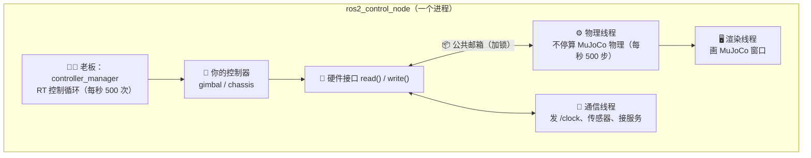
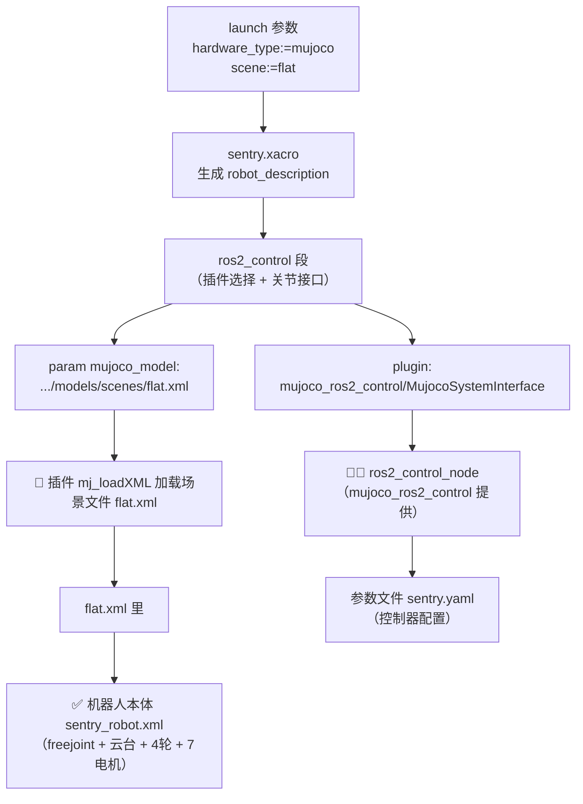
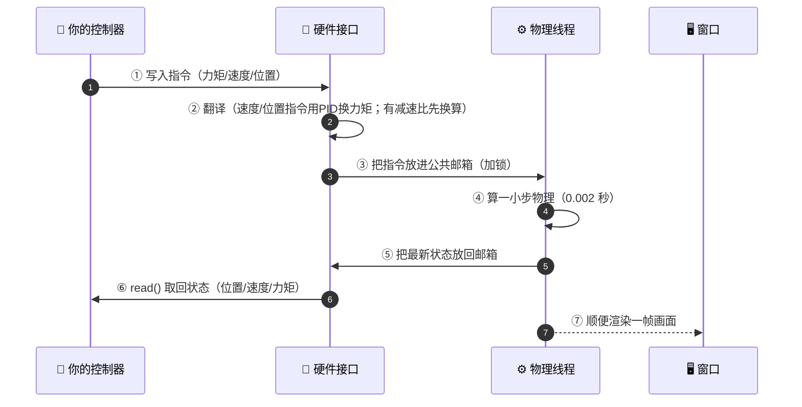
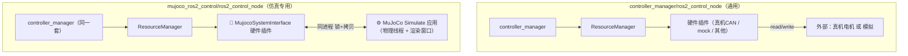
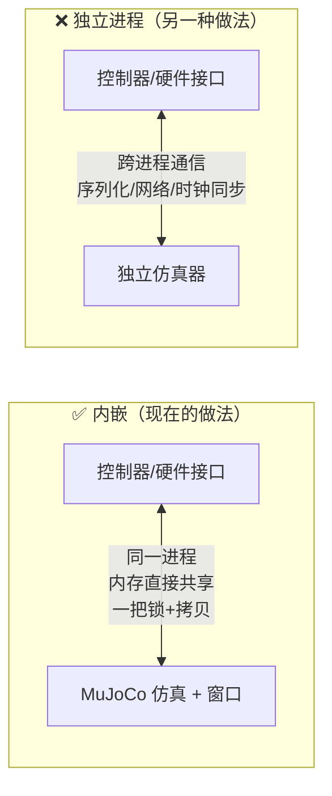
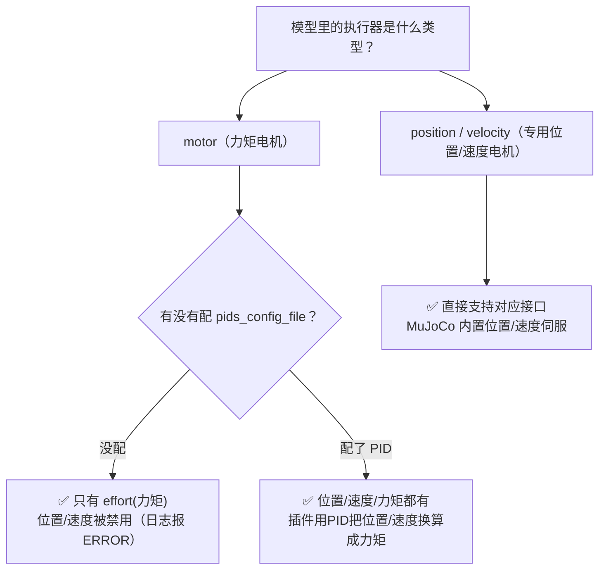
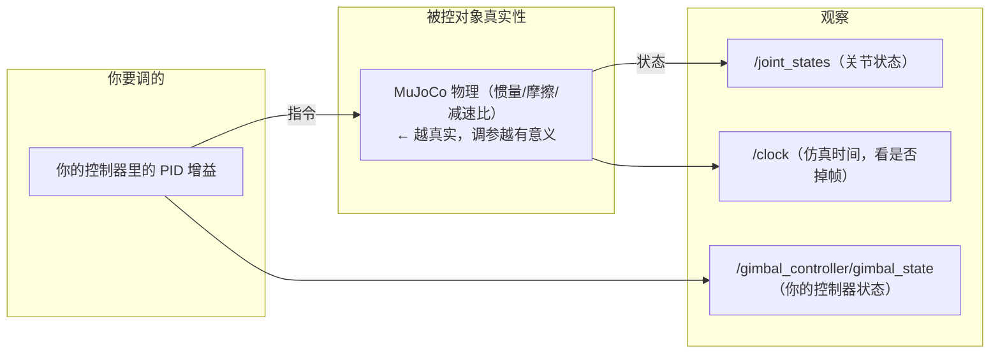

# mujoco_ros2_control 总览（机制 / 数据流 / 配置流 / 常见问题）

日期：2026-08-21
配套文档：`mujoco可视化窗口选择.md`（选型）、`mujoco后续开发指南.md`（开发路线）

---

## 1. 一句话说清它是什么

> 这个插件 = 把 **MuJoCo 的仿真窗口程序**塞进了 ros2_control 里，
> 让你的控制器（上位机）能和 MuJoCo 物理（被控对象）在**同一个进程**里互相传数据。

自研接口是"控制器叫一下，物理动一下"；
这个插件是"物理自己一直在动，控制器时不时去拿一下最新状态、放一下最新指令"。

---

## 2. 整体架构（一个进程里谁在干活）

| 角色 | 干的事 |
|---|---|
| 🧑‍💼 老板 controller_manager | 按固定频率叫"控制器算一下" |
| 🧮 你的控制器 | 读状态 → 算控制量 → 发指令 |
| 🔌 硬件接口 | 在"你的指令"和"物理世界"之间做翻译官 |
| ⚙️ 物理线程 | 一直算物理（相当于真机的"机械+电机"） |
| 🖥️ 渲染线程 | 把物理结果画成窗口 |
| 📡 通信线程 | 对外发消息（时钟/传感器）、接服务 |

关键点：物理线程和控制循环是**两个人在抢同一份数据**，所以用"**一份数据两副本 + 一把锁**"：

---

## 3. 配置与数据流向（从 launch 到模型加载）

**重点：`sentry_robot.xml` 不是直接传的**，而是经过两步间接：

| 文件 | 作用 | 被谁引用 |
|---|---|---|
| `sentry.xacro` | 决定插件 + 关节接口 + 场景路径 | launch 生成 robot_description |
| `scenes/*.xml` | 世界/地形 + `include` 机器人 | 插件 `mujoco_model` 参数 |
| `sentry_robot.xml` | 机器人本体（电机/关节/几何） | 场景文件的 `<include>` |

所以**加新场景** = 新建 `scenes/xxx.xml`（include 机器人 + 加地形），launch 传 `scene:=xxx` 即可，机器人本体不用动。

---

## 4. 运行时数据流（一个周期，1/500 秒）

一句话版：**你写指令 → 接口翻译 → 物理算 → 状态拿回来 → 你再看下个周期**。

---

## 5. mujoco 的 ros2_control_node vs 官方 controller_manager 的

**要点：mujoco 的 node 内部还是跑 controller_manager（同一套东西）**，只是额外内嵌了 MuJoCo。
区别只有一句：官方 node 是"通用管理器，不管后面接啥"；mujoco node 是"管理器 + 把 MuJoCo 一起装进来"。

---

## 6. 为什么"内嵌"到硬件插件里

是**硬件插件 `MujocoSystemInterface` 自己创建并住着 MuJoCo Simulate 应用**（头文件 `sim_` 成员 + 三个线程都是它开的），不是外部独立仿真器进程。

内嵌的**三个理由**：
1. **快**：控制器每 1/500 秒读状态写指令，同进程内存共享是纳秒级；跨进程 IPC 慢且容易拖垮实时循环。
2. **省事**：跨进程要同步时钟（谁快谁慢、暂停重放麻烦）；内嵌后 Simulate 直接发 `/clock`，天然同步。
3. **ros2_control 硬件插件本来就是进程内加载的**：`SystemInterface` 被 `ResourceManager` 同进程 pluginlib 加载，天生能直接持有 `mjModel/mjData` 指针、自己开线程跑 Simulate。

---

## 7. 接口类型：为什么现在"只有力矩"、怎么扩展

- 我们 `sentry_robot.xml` 全用 `motor` + 没配 PID → 所以只有 effort（与你的 effort 控制链一致）。
- 想有位置/速度：① 加 `pids_config_file`（插件内 PidROS），或 ② 把对应关节执行器改成 `position`/`velocity` 类型。

---

## 8. 与自研接口的差别

| 对比项 | 自研 MujocoInterface | mujoco_ros2_control |
|---|---|---|
| 物理怎么跑 | 控制器叫一下，read() 里补一步 | 独立物理线程一直跑 |
| 有没有窗口 | 无（只能看 RViz） | ✅ 有 MuJoCo 原生窗口 |
| 时间怎么算 | 真实时钟 | ✅ /clock 仿真时钟 |
| 数据安全 | 单线程不冲突 | 锁 + 双副本 |
| 传感器 | 无 | 相机/雷达/IMU 等 |
| 额外能力 | 无 | 暂停/单步/重置/拖动物体 |

---

## 9. 对运动控制调参的意义

> 记住：**接口不是瓶颈（位置/速度/力矩都能有），瓶颈是物理参数真不真实**。
> 物理参数是占位的，调出来的 PID 拿到真机上会不一样。
