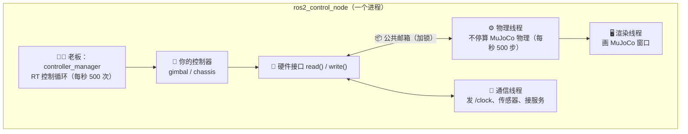
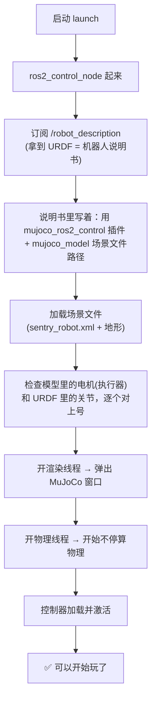
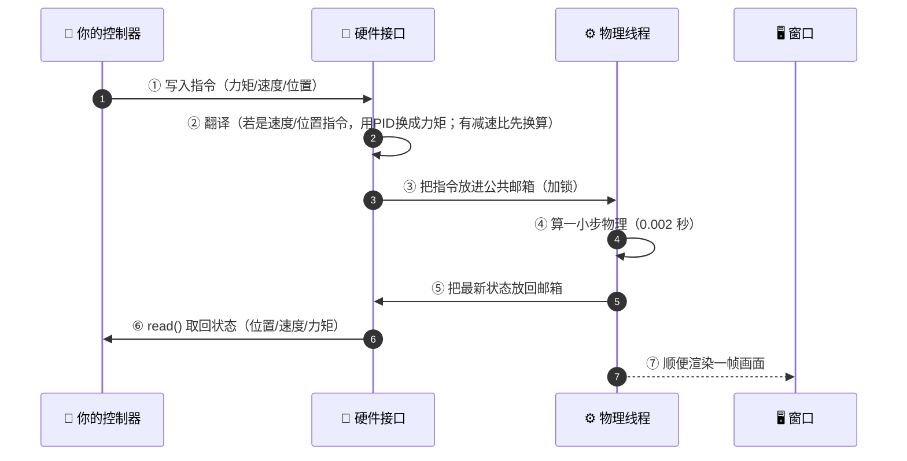
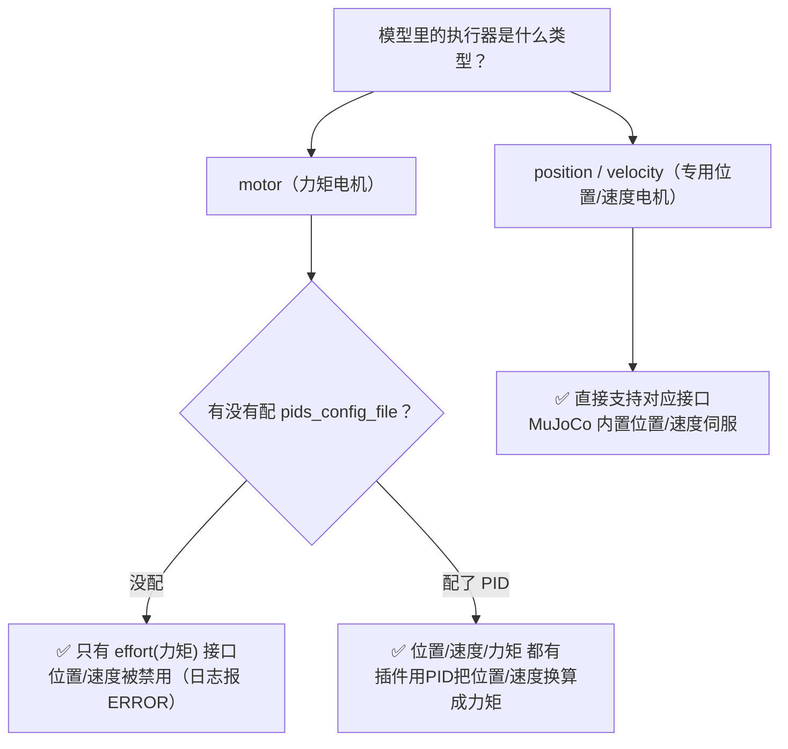
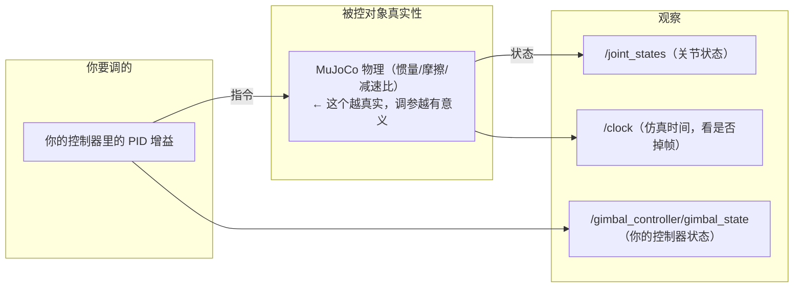

# mujoco_ros2_control 机制与数据流向（大白话 + 流程图）

日期：2026-08-21

---

## 1. 一句话说清它是啥

> 这个插件 = 把 **MuJoCo 的仿真窗口程序**塞进了 ros2_control 里，
> 让你的控制器（上位机）能和 MuJoCo 物理（被控对象）在**同一个进程**里互相传数据。

你自研的接口是"控制器叫一下，物理动一下"；
这个插件是"物理自己一直在动，控制器时不时去拿一下最新状态、放一下最新指令"。

---

## 2. 一个进程里，谁在干活（整体图）

对应关系（好记）：
| 角色 | 干的事 |
|---|---|
| 🧑‍💼 老板 controller_manager | 按固定频率叫"控制器算一下" |
| 🧮 你的控制器 | 读状态 → 算控制量 → 发指令 |
| 🔌 硬件接口 | 在"你的指令"和"物理世界"之间做翻译官 |
| ⚙️ 物理线程 | 一直算物理（相当于真机的"机械+电机"） |
| 🖥️ 渲染线程 | 把物理结果画成窗口（你看到的画面） |
| 📡 通信线程 | 对外发消息（时钟/传感器）、接服务（重置等） |

---

## 3. 关键点：为什么是"一份数据两副本 + 一把锁"

物理线程和控制循环是**两个人在抢同一份数据**，会打架（数据竞争）。
所以插件做了两件事：

- 控制器改的是**控制侧副本**，物理线程读的是**实时数据**
- 两边通过"**一把锁 + 拷贝**"交换——拿到锁才敢动，保证不冲突
- 你不用管细节，只要知道：**数据交换是加锁的、安全的**

---

## 4. 启动时发生了什么（流程图）

---

## 5. 运行时数据怎么流（核心！一个周期）

一个控制周期（1/500 秒）里，数据这么转：

一句话版：**你写指令 → 接口翻译 → 物理算 → 状态拿回来 → 你再看下个周期**。

---

## 6. 为什么你现在"只有力矩接口"（决策图）

结论：**想有位置/速度接口 → 要么配 `pids_config_file`，要么把执行器类型改成 position/velocity。**

---

## 7. 调参时你该看什么（一张图）

> 记住：**接口不是瓶颈（位置/速度/力矩都能有），瓶颈是物理参数真不真实**。
> 物理参数是占位的，调出来的 PID 拿到真机上会不一样。

---

## 8. 和自研接口的差别（一图流）

| 对比项 | 自研 MujocoInterface | mujoco_ros2_control |
|---|---|---|
| 物理怎么跑 | 控制器叫一下，read() 里补一步 | 独立物理线程一直跑 |
| 有没有窗口 | 无（只能看 RViz） | ✅ 有 MuJoCo 原生窗口 |
| 时间怎么算 | 真实时钟 | ✅ /clock 仿真时钟 |
| 数据安全 | 单线程不冲突 | 锁 + 双副本 |
| 传感器 | 无 | 相机/雷达/IMU 等 |
| 额外能力 | 无 | 暂停/单步/重置/拖动物体 |
