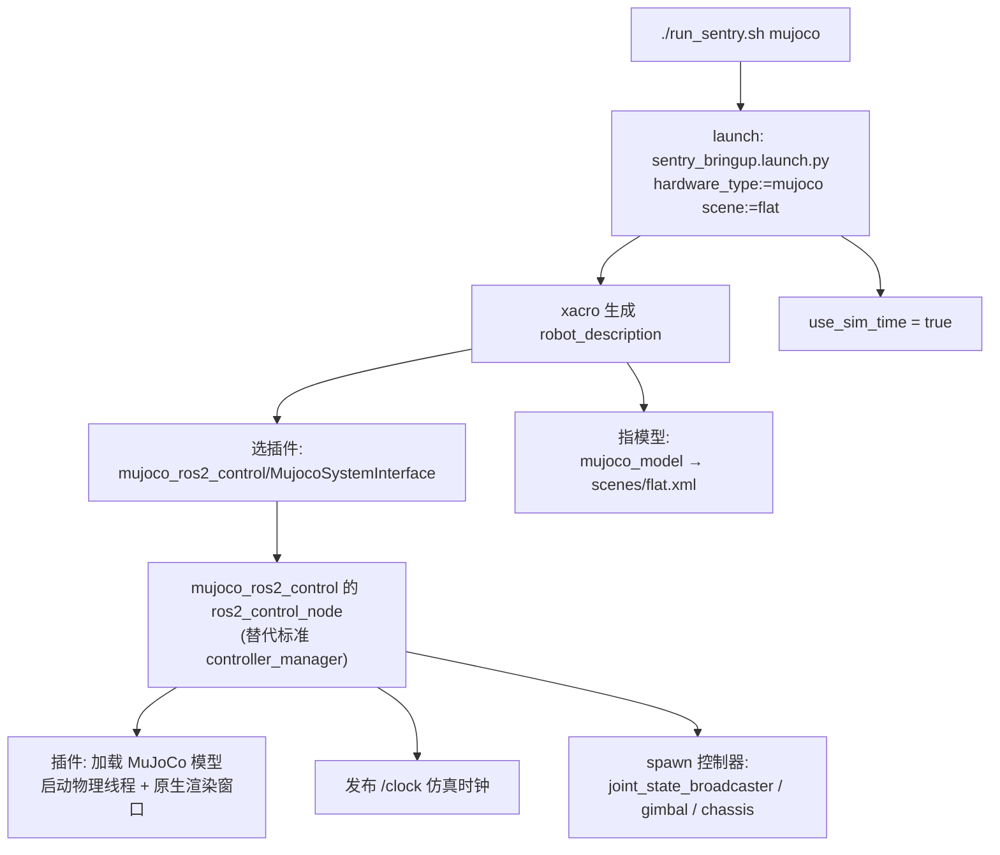
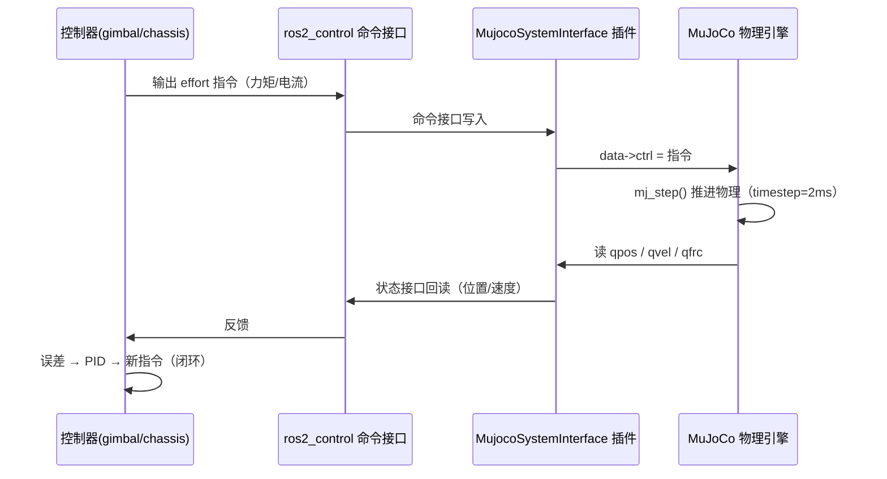

# ros2_control 接入 MuJoCo（mujoco_ros2_control 方案）

日期：2026-08-28
面向读者：负责仿真 / 运动控制（对标下位机电控）的同学

---

## 一、接入的本质：选插件 + 指模型

MuJoCo 接入 ros2_control **不需要自己写物理引擎桥**。核心只有两步，都在
`sentry.xacro` 里完成：

```xml
<!-- ① 选插件：把 MuJoCo 包装成一个 ros2_control "硬件" -->
<plugin>mujoco_ros2_control/MujocoSystemInterface</plugin>

<!-- ② 指模型：告诉插件加载哪个 MuJoCo 场景文件 -->
<param name="mujoco_model">$(find spr_sentry_description)/models/scenes/$(arg scene).xml</param>
```

剩下的**物理仿真、渲染窗口、和 ros2_control 的桥接，全部由
`mujoco_ros2_control` 第三方插件内部接管**。

> 大白话：插件就像一个"翻译官"，让 ros2_control 以为自己在跟一块**真硬件**
> 打交道（写力矩、读角度），实际上它内部在偷偷调用 MuJoCo 引擎算物理，
> 再把结果翻译回传感器读数。你的控制器根本不知道"下面"是仿真。

---

## 二、启动链路（谁选中了谁）



关键点：`hardware_type:=mujoco` 时，launch 会：

- 用 `mujoco_ros2_control` 提供的 `ros2_control_node`（而不是标准
  `controller_manager` 节点）；
- 开启 `use_sim_time=true`；
- 控制器仍是从 `sentry.yaml` 读参数（500Hz），正常 spawn。

---

## 三、插件内部：把 MuJoCo 伪装成硬件的桥

`MujocoSystemInterface` 内部维护：

- **物理线程**：按 `scene.xml` 的 `<option timestep>` 跑 `mj_step()`；
- **渲染线程**：启动 MuJoCo **原生 simulate 窗口**（`mj::Simulate`）；
- **桥接**：ros2_control 命令接口 ↔ MuJoCo `data->ctrl`；MuJoCo `qpos/qvel`
  ↔ ros2_control 状态接口。

---

## 四、数据流闭环



---

## 五、这个理解能解释的常见坑

| 现象 | 原因（都源于这条链路） |
|------|----------------------|
| 改模型/参数后要 `colcon build` | `mujoco_model` 和 yaml 都解析到 **install/ 副本**，不改 build 不生效 |
| 窗口是 MuJoCo 原生界面 | 插件直接启动了 **MuJoCo simulate 窗口** |
| 左右 UI 面板看不到 | 插件启动时硬编码隐藏（`ui0/ui1_enable=false`），按 **Tab / Shift+Tab** 恢复 |
| `Ctrl+右键双击` 能跟随相机 | 因为就是 simulate，内置 tracking 功能；`Esc` 回自由相机 |
| 报错 `unrecognized attribute: damping` | 模型 XML 由 MuJoCo 直接解析，`<freejoint>` **不支持 damping**（普通 `<joint>` 才支持） |
| 物理步长 2ms、控制率 500Hz | `scene.xml` 的 `<option timestep="0.002">` + `sentry.yaml` 的 `update_rate: 500` |

---

## 六、关键参数一览

| 项 | 值 | 位置 |
|----|-----|------|
| 物理步长 | 0.002 s | `models/*.xml` → `<option timestep>` |
| 控制率 | 500 Hz | `config/sentry.yaml` → `controller_manager.update_rate` |
| 控制器 | joint_state_broadcaster / gimbal / chassis | `sentry.yaml` + launch spawn |
| 场景切换 | `scene:=flat\|rough\|ramp\|jump` | `run_sentry.sh mujoco <scene>` |
| 命令/状态接口 | position / velocity / effort | `sentry.xacro` 每个 joint |

---

## 附：相关文件

- 插件声明：`src/spr_ctrl_bring_up/description/sentry.xacro`（hardware_type 三选一）
- 场景模型：`src/spr_sentry_description/models/scenes/*.xml`（include `sentry_robot.xml`）
- 控制器参数：`src/spr_ctrl_bring_up/config/sentry.yaml`
- 启动入口：`run_sentry.sh` / `sentry_bringup.launch.py`
- 稳定性调试经验：`discussion/mujoco_disscus/云台稳定性调试经验.md`
